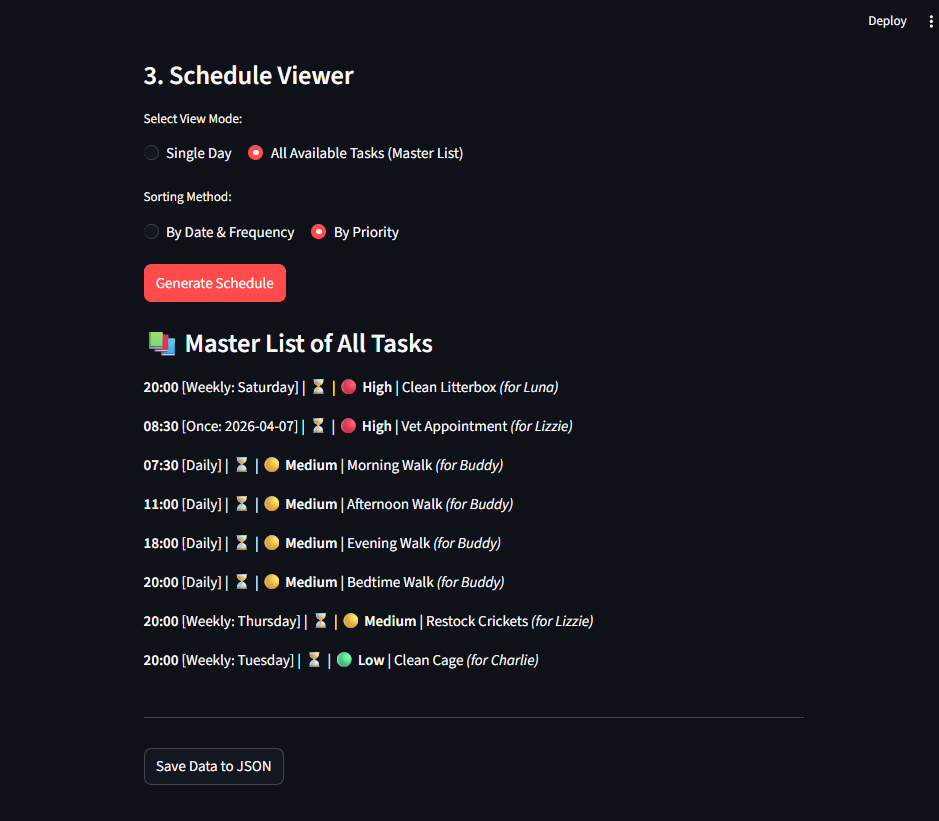

# 🐾 PawPal+ Dashboard (Module 2 Project)

**PawPal+** is a professional-grade pet care coordinator built with Python and Streamlit. It helps busy pet owners organize daily itineraries, manage recurring medical tasks, and visualize their pet's schedule with intelligent priority-based sorting. By tracking daily and weekly tasks, constraints, and priorities, PawPal+ serves as a smart assistant to produce efficient daily pet care plans.

## 📸 Demo

<!-- markdownlint-disable MD033 -->
<a href="screenshots/pawpal_demo.png" target="_blank">
  
</a>
<!-- markdownlint-enable MD033 -->

## ✨ Key Features

- **Multi-Pet Management**: Easily add and track tasks for multiple pets under a single centralized user profile.
- **Data Persistence**: Start a new profile or load an existing one. All pets, tasks, and constraints are securely serialized and saved locally (e.g., `[User]_pawpal_data.json`).
- **Smart Scheduling**: Let the app intelligently build a schedule for you by sorting tasks by priority (`High -> Medium -> Low`) and chronological time.
- **Auto-Recurring Tasks**: Using Python's `timedelta`, the `Scheduler` calculates the next date occurrence for Daily/Weekly tasks when marked complete.
- **Conflict Detection**: Built-in algorithm (`O(n log n)`) to detect and warn you if two tasks share the exact same starting time.
- **Dynamic Views**: Toggle between viewing tasks for a single specific day, or viewing the master list of all tasks.

## 🚀 Getting Started

### Prerequisites

Ensure you have Python 3.8+ installed.

### Setup

```bash
# Create and activate a virtual environment
python -m venv .venv
source .venv/bin/activate  # On Windows: .venv\Scripts\activate

# Install the required dependencies
pip install -r requirements.txt
```

### Running the App

To launch the Streamlit dashboard, run the following command in your terminal:

```bash
python -m streamlit run app.py
```

## 🧪 Testing

You can run the full automated test suite using the following command:

```bash
python -m pytest
```

Our tests ensure rock-solid stability across 5 core behaviors:

1. Basic Task Addition
2. Status Completion Marking
3. Verification of exact Chronological Sorting
4. Auto-generation logic for recurring Daily/Weekly tasks using `timedelta`
5. Proper conflict detection tagging for identical time-slots

**Confidence Level**: 🌟🌟🌟🌟🌟 (5/5 Stars! 100% of our algorithms have formal, passing assertions!)
