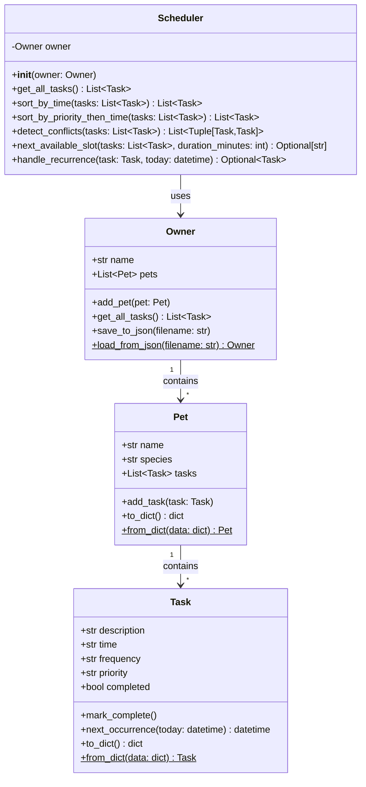
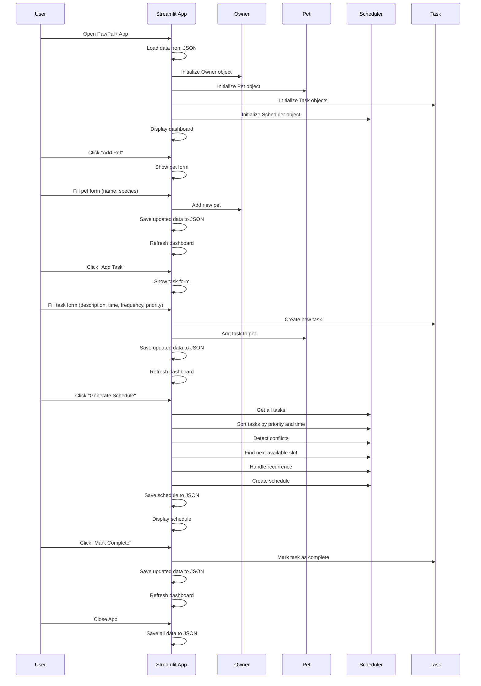

# System Design UML

## Class Diagram

```mermaid
classDiagram
    class Task {
        +str description
        +str time
        +str frequency
        +str priority
        +bool completed
        +mark_complete()
        +next_occurrence(today: datetime) datetime
        +to_dict() dict
        +from_dict(data: dict) Task$
    }

    class Pet {
        +str name
        +str species
        +List~Task~ tasks
        +add_task(task: Task)
        +to_dict() dict
        +from_dict(data: dict) Pet$
    }

    class Owner {
        +str name
        +List~Pet~ pets
        +add_pet(pet: Pet)
        +get_all_tasks() List~Task~
        +save_to_json(filename: str)
        +load_from_json(filename: str) Owner$
    }

    class Scheduler {
        -Owner owner
        +__init__(owner: Owner)
        +get_all_tasks() List~Task~
        +sort_by_time(tasks: List~Task~) List~Task~
        +sort_by_priority_then_time(tasks: List~Task~) List~Task~
        +detect_conflicts(tasks: List~Task~) List~Tuple[Task,Task]~
        +next_available_slot(tasks: List~Task~, duration_minutes: int) Optional[str]
        +handle_recurrence(task: Task, today: datetime) Optional~Task~
    }

    Owner "1" --> "*" Pet : contains
    Pet "1" --> "*" Task : contains
    Scheduler --> Owner : uses
```

## Sequence Diagram

```mermaid
sequenceDiagram

    participant User
    participant App as Streamlit App
    participant Owner
    participant Pet
    participant Scheduler
    participant Task

    User->>App: Open PawPal+ App
    App->>App: Load data from JSON
    App->>Owner: Initialize Owner object
    App->>Pet: Initialize Pet object
    App->>Task: Initialize Task objects
    App->>Scheduler: Initialize Scheduler object
    App->>App: Display dashboard

    User->>App: Click "Add Pet"
    App->>App: Show pet form

    User->>App: Fill pet form (name, species)
    App->>Owner: Add new pet
    App->>App: Save updated data to JSON
    App->>App: Refresh dashboard

    User->>App: Click "Add Task"
    App->>App: Show task form

    User->>App: Fill task form (description, time, frequency, priority)
    App->>Task: Create new task
    App->>Pet: Add task to pet
    App->>App: Save updated data to JSON
    App->>App: Refresh dashboard

    User->>App: Click "Generate Schedule"
    App->>Scheduler: Get all tasks
    App->>Scheduler: Sort tasks by priority and time
    App->>Scheduler: Detect conflicts
    App->>Scheduler: Find next available slot
    App->>Scheduler: Handle recurrence
    App->>Scheduler: Create schedule
    App->>App: Save schedule to JSON
    App->>App: Display schedule

    User->>App: Click "Mark Complete"
    App->>Task: Mark task as complete
    App->>App: Save updated data to JSON
    App->>App: Refresh dashboard

    User->>App: Close App
    App->>App: Save all data to JSON
```
